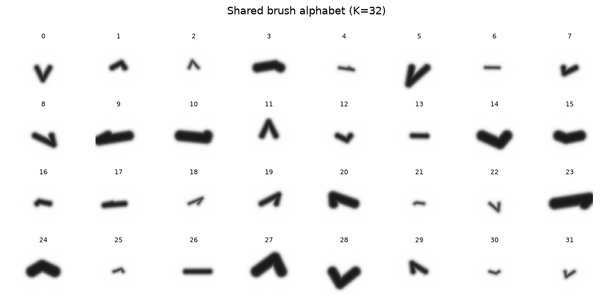
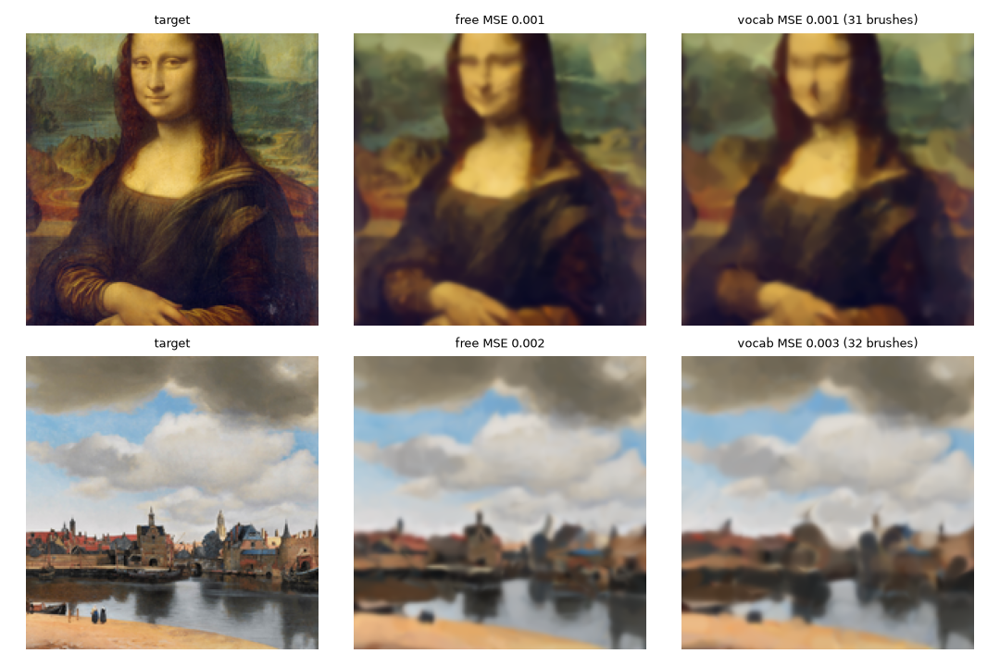
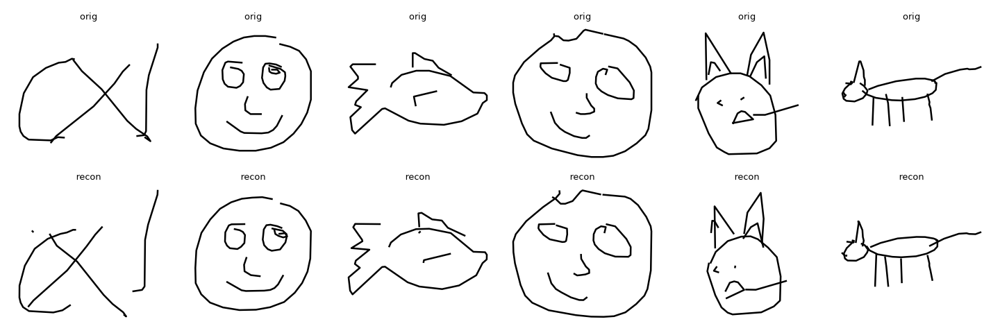
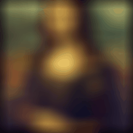

# brush-tokens

A **shared, learned vocabulary of brush strokes** for images — plus the
differentiable renderers and stroke tokenizers to build and use it.

Motivation: text-token LLMs reason poorly about spatial structure (see
[think-visually](https://github.com/kilojoules/think-visually) — *"a monitor
cannot rescue what the model cannot produce"*). Strokes are a compositional,
inspectable visual substrate. This repo builds the tokenizers and renderers to
test whether letting models *draw* their reasoning adds capability text can't.

## A real brush vocabulary — `vocab.py`

A brush is a *mark*, not a color: you dip the same brush in any paint. So the
vocabulary is a codebook of **shapes** — `(length, width, bend)`, invariant to
where it's placed, how it's rotated, and what color it is. It is learned **once**
over a corpus of paintings and then reused, unchanged, on **held-out** images it
never saw. That last part is the test the earlier per-image codebook failed.



*The 32 learned brushes — distinct marks (thin/thick dashes, arcs, V's,
checkmarks), color-free. Trained on 6 paintings (Starry Night, Girl with a Pearl
Earring, American Gothic, La Grande Jatte, The Scream, Monet's Impression).*



*Held-out (never in the corpus): each stroke's shape is snapped to one of the 32
fixed brushes; only position/orientation/color are refit. The vocabulary-only
paintings (right) match the unconstrained fit (middle) closely.*

**Is it actually a vocabulary?** The numbers, versus the naive per-image k-means
in `paint.py`:

| | per-image k-means (`paint.py`) | **shared vocab (`vocab.py`)** |
|---|---|---|
| trained on | one image | 6-painting corpus |
| singleton codes | 147 / 512 | **0 / 32** |
| strokes per code (median) | ~1 | **91** |
| codes reused across ≥2 images | — | **32 / 32** |
| held-out reconstruction | n/a | **Mona Lisa MSE 0.0011** (free 0.0008) |

Zero singletons, every brush used ~91×, every brush appears in ≥2 paintings, and
the fixed alphabet reconstructs unseen images (Mona Lisa 0.0011, Vermeer's *View
of Delft* 0.0025) almost as well as unconstrained strokes.

```bash
modal run vocab.py --k-brushes 32
modal volume get brush-vocab /out ./vocab_out   # brush_alphabet.png, heldout_vocab.png, vocab.json
```

## Other pieces

### `modal_vq_stroke.py` — stroke VQ tokenizer (line sketches)
A VQ-VAE over QuickDraw pen-stroke sequences (SketchRNN stroke-3 format). Any
sketch → sequence of stroke-token IDs → reconstructed strokes.

- GRU encoder → per-step **EMA** vector quantizer → GRU decoder.
- **Dead-code revival** resets unused codes each epoch (loss-based VQ collapsed
  to ~20/512; EMA + revival reaches full 509–512/512 utilization).
- 350k sketches, ~20 min on a T4. Reconstructs recognizable doodles from 512
  discrete codes.



*Top: original sketches. Bottom: reconstructed from 512 discrete stroke codes.*

```bash
modal run modal_vq_stroke.py --categories cat,face,apple --epochs 20
```

### `paint.py` — differentiable painter + per-image tokenization (demo)
The renderer and a visual demo, **not** the shared vocabulary. Optimizes colored
capsule strokes coarse-to-fine on a blank canvas to reconstruct one image, then
tokenizes it: geometry → 128-bin **coordinate tokens**, appearance → a **512-code
codebook fit to that single image**. Good for animation and as a rendering
sanity check; the codebook does *not* generalize across images (that's what
`vocab.py` is for).



*From a blank white canvas, ~1220 strokes replayed in paint order (coarse
block-in → fine detail), one batch per frame.*

- One lesson worth keeping: k-means over *absolute stroke position* averages
  strokes across the image (blocky mush). Snapping position to a coordinate grid
  instead preserves location and drops tokenized MSE ~4× (0.009 → 0.002).

```bash
modal run paint.py --steps 250
modal volume get brush-paint /out ./paint_out    # compare.png, drawing.gif, tokens.json
```

## Roadmap

1. ✅ Stroke VQ tokenizer (line sketches).
2. ✅ Differentiable brush painter + renderer.
3. ✅ **Shared brush-token vocabulary** — learned on a corpus, reconstructs
   held-out images from a fixed alphabet.
4. Autoregressive model over brush-token sequences (generate, not just fit) —
   design in [docs/ar-brush-gpt.md](docs/ar-brush-gpt.md).
5. Graft the vocabulary onto a small LLM (Qwen2.5-1.5B); interleaved text↔stroke
   reasoning on a spatial task, with the think-visually fold/maze verifiers as
   reward — does drawing-while-reasoning beat the text-only baseline?

Full end-to-end plan (phases, gates, confounds, kill criteria):
[docs/training-program.md](docs/training-program.md).

## Requirements

[Modal](https://modal.com) for compute (`pip install modal`, then
`modal token new`). QuickDraw data (Google, CC-BY 4.0) and public-domain
paintings (Wikimedia) are fetched at runtime.

## License

MIT
