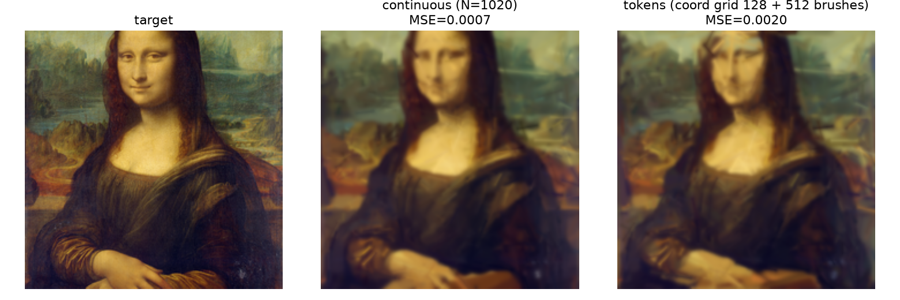
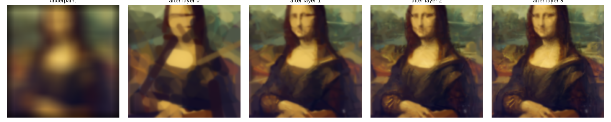

# brush-tokens

Discrete **brush/stroke tokens** for images — a visual vocabulary of pen and
paint strokes, and experiments in reasoning and rendering with them.

Motivation: text-token LLMs reason poorly about spatial structure (see
[think-visually](https://github.com/kilojoules/think-visually) — *"a monitor
cannot rescue what the model cannot produce"*). Strokes are a compositional,
inspectable visual substrate. This repo builds the tokenizers and renderers to
test whether letting models *draw* their reasoning adds capability text can't.



*Left: target. Middle: 1020 continuous brush strokes (MSE 0.0007). Right: fully
tokenized — each stroke is **4 coordinate tokens (128-bin grid) + 1 brush token
(512-code appearance codebook)** — re-rendered at MSE 0.0020, near-identical to
the continuous fit.*

## What's here

### `modal_vq_stroke.py` — stroke VQ tokenizer
A VQ-VAE over QuickDraw pen-stroke sequences (SketchRNN stroke-3 format). Learns
a discrete codebook: any sketch → sequence of stroke-token IDs → reconstructed
strokes.

- GRU encoder → per-step **EMA** vector quantizer → GRU decoder.
- **Dead-code revival** resets unused codes each epoch (loss-based VQ collapsed
  to ~20/512; EMA + revival reaches full 509–512/512 utilization).
- 350k sketches, 5 categories, ~20 min on a T4. Reconstructs recognizable
  doodles from 512 discrete codes.

```bash
modal run modal_vq_stroke.py --categories cat,face,apple --epochs 20
modal volume get stroke-vq /out ./out    # checkpoint + recon.png
```


*Top: original sketches. Bottom: reconstructed from 512 discrete stroke codes.*

### `paint.py` — paint an image with brush-stroke tokens
Differentiable stroke-based rendering (the *Learning to Paint* family). Optimizes
a set of colored capsule brush strokes coarse-to-fine to reconstruct a target
raster (default: the Mona Lisa, public domain), then **tokenizes every stroke**
and re-renders — the painting reproduced from a fully discrete token stream.

- Capsule strokes (segment + width + RGBA), soft coverage, alpha compositing.
- Coarse-to-fine layers over a blurred underpainting (~1020 strokes).
- Tokenization mirrors real stroke-token models (DeepSVG, StrokeNUWA):
  **geometry → coordinate tokens** (snap to a 128-bin grid) and **appearance
  (width/color/opacity) → a 512-code brush codebook** (k-means). Each stroke =
  4 coordinate tokens + 1 brush token.
- Quantizing *absolute position* with k-means averages strokes across the image
  (blocky mush); a coordinate grid preserves location and drops tokenized MSE
  ~4× (0.009 → 0.002).

```bash
modal run paint.py --steps 300 --codes 256
modal volume get brush-paint /out ./paint_out    # compare.png, tokens.json, ...
```

Outputs `target | continuous | tokenized` comparison, per-layer progression, and
`tokens.json` (the brush-token sequence + codebook).



*Coarse-to-fine: blurred underpainting → 80 coarse → 140 medium → 220 fine
strokes.*

## Roadmap

1. ✅ Stroke VQ tokenizer (line sketches).
2. ✅ Brush-token painter (raster → discrete stroke tokens).
3. Graft a stroke-token vocabulary onto a small LLM (Qwen2.5-1.5B); interleaved
   text↔stroke reasoning on a toy spatial task.
4. Wire the think-visually fold/maze verifiers as reward — does drawing-while-
   reasoning beat the text-only baseline?

## Requirements

[Modal](https://modal.com) for compute (`pip install modal`, then
`modal token new`). QuickDraw data (Google, CC-BY 4.0) and the Mona Lisa
(Wikimedia, public domain) are fetched at runtime.

## License

MIT
